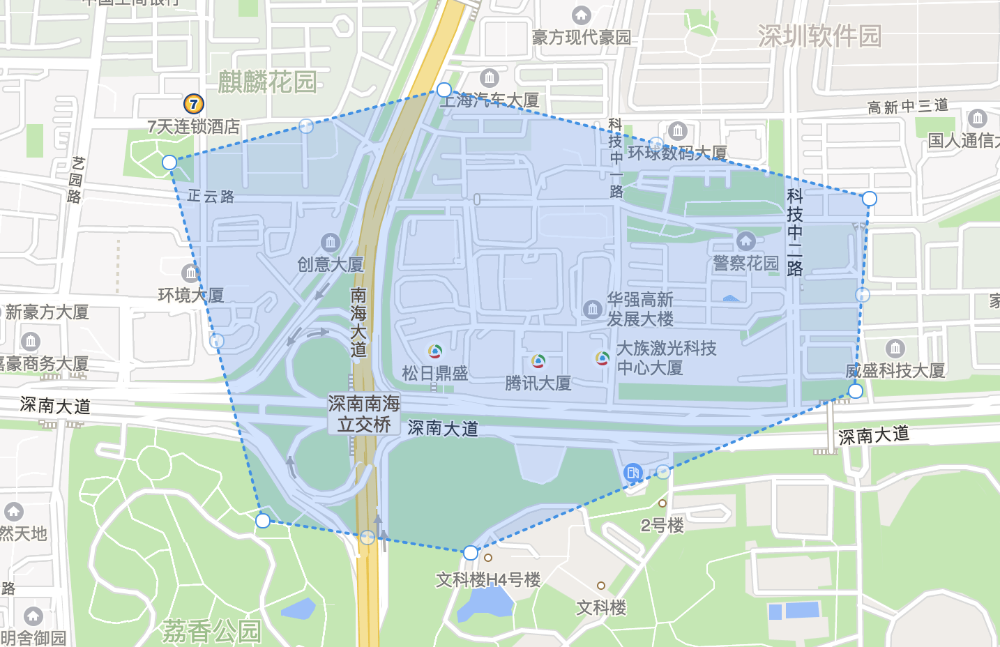
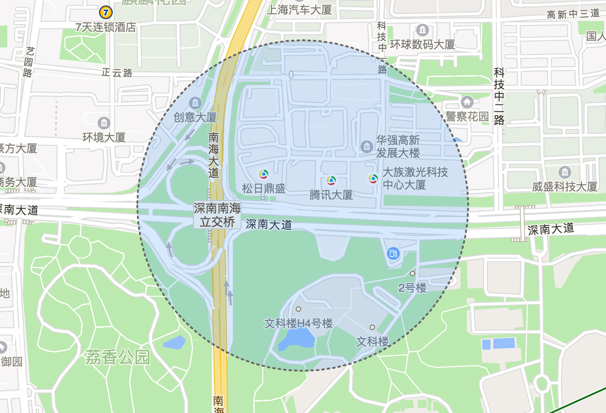
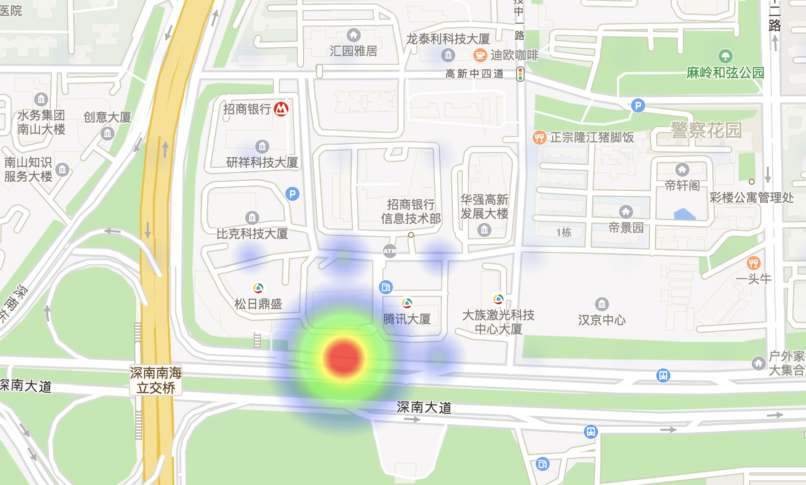
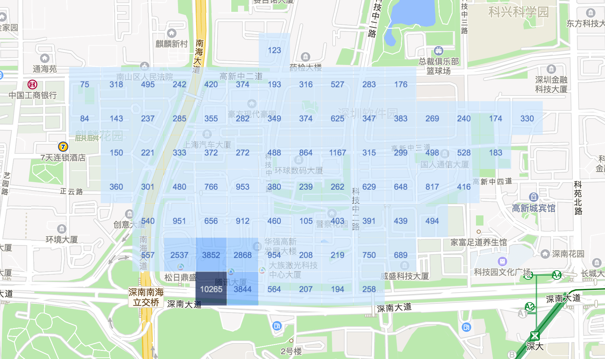

## 腾讯地图 React 实现

### 使用案例

[Demo](https://github.com/lichenbuliren/qq-map-react)

## 支持组件列表

- [QMap 地图组件](#user-content-qmap-地图组件)
- [Marker 标记组件](#user-content-marker-标记组件)
- [MarkerList 标记列表](#user-content-markerlist-标记组件)
- [Polygon 多边形](#user-content-polygon-多边形)
- [Circle 圆形](#user-content-circle-圆形)
- [Heatmap 热力图](#user-content-heatmap-热力图)
- [Info 提示层](#user-content-info-提示层)
- [Polyline 折线](#user-content-polyline-折线)
- [自定义控件](#user-content-自定义控件)
- [网格热力图](#user-content-网格热力图)

## 基本用法

在页面模板层，引入基础地图库: [传送门](http://lbs.qq.com/javascript_v2/guide-base.html)
组件支持官方的所有方法与属性

### 1、引入 QQ 地图库

  ``` html
  <script src="//map.qq.com/api/js?v=2.exp&key=[开发者个人密钥]"></script>
  ```

### 2、如果要使用默认热力图组件，需要额外引入热力图库

  ``` html
  <script src="http://open.map.qq.com/apifiles/plugins/heatmap/heatmap.min.js"></script>  
  ```

## QMap 地图组件

支持的 `options` ，除了地图官方默认支持的属性 [MapOptions](http://lbs.qq.com/javascript_v2/doc/mapoptions.html) 之外，额外支持

- ``` center: { lat: number, lng: number }``` 地图中心点，经纬度规格为腾讯地图经纬度规格

``` jsx
<QMap
  center={center}
  style={{ height: '800px' }}
  zoom={zoom}
  events={{
   idle: map => this.handleMapIdle(map)
  }}
></QMap>
```

## Marker 标记组件

``` jsx
<Marker
  position={{lat: xxx, lng: xxx}}
  draggable={true}
  visible
  // 标记提示文案
  decoration="10"
  animation={config.ANIMATION_DROP}
  events={{
      click: this.handleMarkerClick
  }}
/>
```

## MarkerList 标记列表

``` jsx
<MarkerList
  showDecoration
  animation={config.ANIMATION_DROP}
  data={heatData.slice(0, 10)}
  events={{
    click: this.handleMarkerClick
  }} visible={true}
/>
```

## Info 提示弹层组件

``` jsx
<Info
  content={content}
  visible={showInfo}
  position={infoPosition}
  events={{
    closeclick: this.handleInfoClose
  }}
/>
```

## Polygon 多边形



``` jsx
<Polygon
  fillColor={fillColor}
  points={polygonPoints}
  strokeDashStyle={strokeDashStyle}
  editable
  visible
  draggable
  events={{
    adjustNode: e => this.handlePolygonChange(e),
    removeNode: e => this.handlePolygonChange(e),
    insertNode: e => this.handlePolygonChange(e)
  }}
/>
```

## Circle 圆形



``` jsx
<Circle
  center={center}
  radius={radius}
  strokeColor="#666"
  strokeDashStyle="dash"
  strokeWeight={2}
  events={{
    radius_changed: (circle, e) => this.handleRadiusChange(radius, circle, e)
  }}
/>
```

## Heatmap 热力图



``` jsx
const heatMapData = {
  max: 100,
  data: [{
    lat: xxx,
    lng: xxx,
    count: 1000
  }, ...]
}
<HeatMap heatData={heatMapData} options={heatMapOptions} />
```

## 自定义控件

``` jsx
import React from 'react'
import { ControlPosition, Control } from 'qmap'

export default class CustomControl extends Control {
  static defaultProps = {
    position: ControlPosition.TOP_CENTER,
    style: {},
    onEdit: () => {},
    onChoose: () => {}
  }

  render () {
    const { style, onEdit, onChoose } = this.props
    return (
      <div ref={node => (this.controlNode = node)} style={style}>
        <div className="tools">
          <button className="tc-15-btn weak" onClick={onEdit}><i className="icon-pen" />编辑</button>
          <button className="tc-15-btn weak selected" onClick={onChoose}><i className="icon-pointer" />选择</button>
        </div>
      </div>
    )
  }
}

```

### 网格热力图
默认提供两种单位的网格热力图实现：px 和 m
其中，单位为『px』的时候，地图缩放会自动聚合，而单位为『m』的时候，这时候绘制的是代表实际地图物理距离，不做缩放处理




具体配置如下：

``` jsx
import { QMap, GridHeatmap } from 'qmap'
// 基础配置
const gridOptions = {
  zIndex: 2,
  fillStyle: 'rgba(55, 50, 250, 1)',
  shadowColor: 'rgba(255, 250, 50, 0.3)',
  shadowBlur: 20,
  // 网格规格
  size: 100,
  // 网格宽度，优先取宽度
  width: 93,
  // 网格高度
  height: 101,
  // 绘制单位
  unit: 'm',
  // 全局 canvas 上下文网格透明度
  globalAlpha: 0.6,
  // 文案绘制配置
  label: {
    show: true,
    fillStyle: 'white',
    shadowColor: 'white',
    font: '12px Arial',
    shadowBlur: 10
  },
  // 渐变色阶，如果 value 值为长度为 2 数组，第二个值为网格文本的色值，这里会覆盖上面的 label 中的 fillStyle 值
  gradient: {
    0.16: ['#ADD7FF', '#fff'],
    0.32: '#87C1FF',
    0.48: '#60A8FF',
    0.64: '#338BFF',
    0.78: '#0752C9',
    1.0: '#0E3CA1'
  }
}

// 在地图 `idle` 事件回调中创建网格热力图
handleMapIdle = map => {
  console.log('map idle')
  const { gridOptions } = this.state
  const dataSet = [{
    lat: 11.212341,
    lng: 131.123123,
    count: 500
  }, ...]
  this.gridHeatmap = new GridHeatmap(map, dataSet, gridOptions)
}

<QMap
  center={{
    lat: 22.54073,
    lng: 113.933571
  }}
  style={{ height: '1000px' }}
  zoom={zoom}
  events={{
    idle: this.handleMapIdle
  }}
>
```

## 特别处理

如果要实现官方的 `addListenerOnce` 方法，只需要在组件的修改组件内部 `get events()` 的配置：__在方法配置里面，配置第二个参数为 true__

``` jsx
get events () {
  return [
    'click',
    ['idle', true],
    'tilesloaded',
    'resize'
  ]
}
```

### 参考资料

- [react-bmap 百度地图 React 实现方式](https://github.com/huiyan-fe/react-bmap)
- [腾讯地图 API](http://lbs.qq.com/javascript_v2/index.html)

## TODOS
- 其他基础地图组件实现
